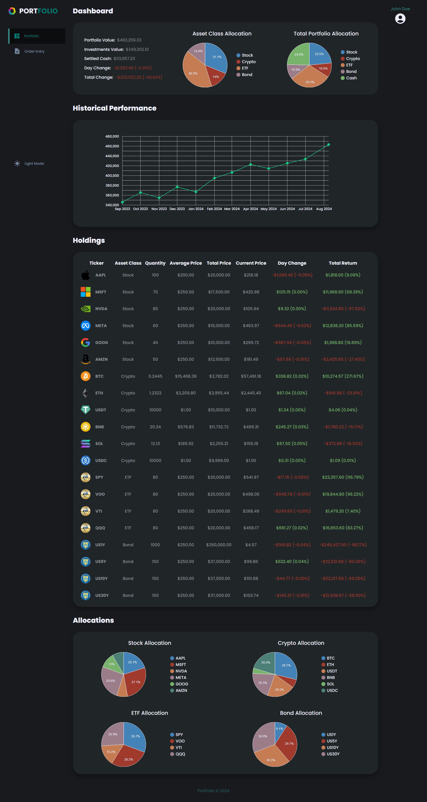
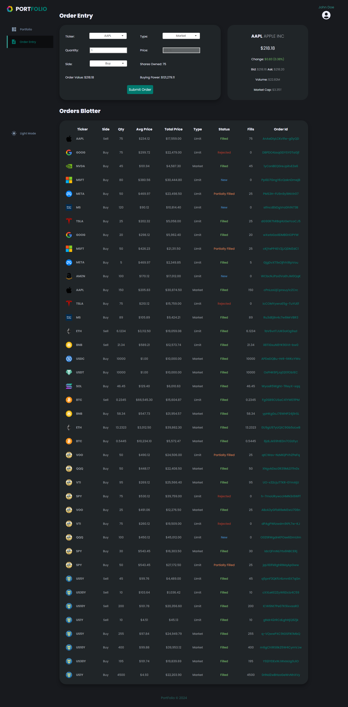
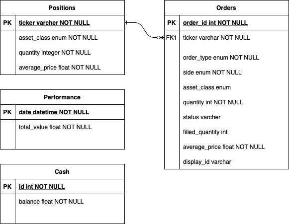

# Portfolio Manager

## Overview
This application is a portfolio manager which allows the user to view their portfolio in a graphical manner as well as trade by sending new orders.

## Features
This application contains two main pages: the Portfolio Dashboard and the Order Entry page.

### Portfolio Dashboard
The Portfolio Dashboard provides an overview of the user's investment portfolio. It includes:
* Historical Performance: A graphical representation in line chart showing the performance of the user's investments over time.
* Holdings: A detailed list of the user's current holdings, including the name of the asset, asset class, quantity, average price, total price, current price, day change in price, and	total return
* Investment Allocation: A visual representation in pie charts of the user's investment distribution across different assets classes.



### Order Entry
The Order Entry page allows users to send orders. It includes:

* Order Form: A form where users can input details to buy or sell stocks including ticker, quantity, side, type, limit price.
* Orders Blotter: A table displaying the user's past orders.



### Simulator
A simulator was created that can be used to test different order statuses.
Quantity thresholds are used to determine status for Buy Limit orders.
The following logic is used to determine status:
- 1-25: Full fill
- 26-50: Partial Fill
- 51-75: Reject
- 76+: Remains in new state, No fills

## Installation

### Back end
* Cd to the database/ directory
```
cd database
```

* Create a virtual environment (optional)
```
python -m venv venv
```

* Activate virtual environment (optional)
```
.\venv\Scripts\activate
```

* Install the dependencies
```
pip install -r requirements.txt
```

* Run the backend
```
python api.py
```

### Front end

> Run the front end by using Live Share extension on VSCode, click "Go Live" button on the bottom right corner. Select web, and enjoy!

### Swagger Documentation
> To see the API documentation, go to '/api/docs/' after your localhost URL.
> All of the endpoints are listed labelled in GET and POST accordingly. To view the documentation of a certain endpoint, click the arrow to expand the documentation.
> Click on the "Try it out" button to view the responses of the api call, this might give different values with different parameter.
> You can change the response format to be either xml or json by changing the dropdown value.

## Database Entity-Relationship Diagram



## Technology Used
* Python, Flask
* Javascript, HTML, CSS
